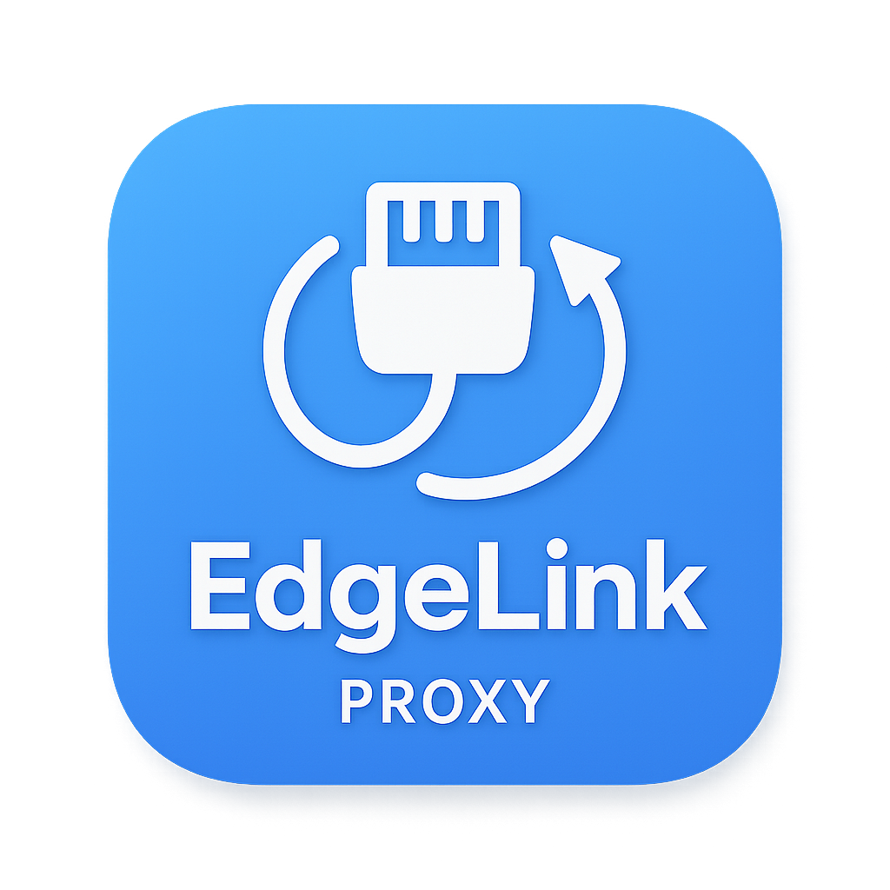

# EdgeLink

<div align="center">
  
  <h3>专为 Minecraft 设计的代理服务器</h3>
  <p>基于 XRay-core 的高性能代理管理工具</p>
</div>

## ✨ 特性

- 🎮 **专为 Minecraft 优化** - 支持 Java 版和基岩版
- 🖥️ **现代化桌面应用** - 基于 Electron 的美观界面
- 🚀 **简单易用** - 一键配置，快速启动
- 🔧 **智能管理** - 自动下载 XRay-core，智能配置优化
- 🌐 **多协议支持** - VLESS、VMess、Trojan 等主流协议
- 📊 **实时监控** - 连接状态、流量统计一目了然

## 🚀 快速开始

### 下载安装

从 [Releases](https://github.com/lilingfengdev/EdgeLink/releases) 页面下载适合您系统的版本：

- **Windows**: `EdgeLink-Windows-x64.exe`
- **macOS**: `EdgeLink-macOS.dmg`
- **Linux**: `EdgeLink-Linux-x64.AppImage` 或 `EdgeLink-Linux-x64.deb`

### 基本使用

1. **启动应用** - 双击运行下载的程序
2. **添加代理** - 点击"添加代理"按钮
3. **填写配置** - 输入服务器地址和端口信息
4. **启动代理** - 点击"启动"按钮开始代理服务
5. **配置游戏** - 在 Minecraft 中设置代理为 `127.0.0.1:本地端口`

## 🛠️ 开发构建

### 环境要求

- Node.js 18+
- npm 或 yarn

### 安装依赖

```bash
npm install
```

### 开发运行

```bash
# 启动桌面应用
npm run electron

# 开发模式
npm run dev
```

### 构建打包

```bash
# 构建当前平台
npm run build

# 构建特定平台
npm run build:win    # Windows
npm run build:mac    # macOS
npm run build:linux  # Linux
```

## 📋 支持的协议

| 协议 | 传输方式 | 安全性 |
|------|----------|--------|
| VLESS | TCP, WebSocket, HTTP/2, gRPC, xHTTP | TLS, Reality |
| VMess | TCP, WebSocket, HTTP/2, gRPC | TLS |
| Trojan | TCP, WebSocket | TLS |

## 🎯 使用场景

- **Minecraft 联机** - 与海外朋友一起游戏
- **服务器访问** - 连接国外 Minecraft 服务器
- **网络优化** - 减少延迟，提升游戏体验
- **隐私保护** - 保护游戏数据传输安全

## 📖 配置说明

### 简单模式
- **服务器地址**: 代理服务器的域名或IP
- **本地端口**: 本地监听端口（默认 1080）
- **协议类型**: TCP 或 UDP
- **用户ID**: 服务器提供的用户标识

### 高级模式
- **传输协议**: 选择合适的传输方式
- **安全设置**: TLS/Reality 配置
- **流量伪装**: 混淆和伪装选项
- **路由规则**: 自定义代理规则

## 🔧 故障排除

### 常见问题

**Q: 无法启动代理服务**
A: 检查端口是否被占用，尝试更换本地端口

**Q: 连接超时**
A: 确认服务器地址和配置信息正确

**Q: XRay 下载失败**
A: 检查网络连接，应用会自动重试下载

**Q: 游戏连接不稳定**
A: 尝试切换不同的传输协议

### 日志查看

应用日志保存在：
- **Windows**: `%APPDATA%/EdgeLink/logs/`
- **macOS**: `~/Library/Application Support/EdgeLink/logs/`
- **Linux**: `~/.config/EdgeLink/logs/`

## 📄 许可证

本项目采用 MIT 许可证 - 查看 [LICENSE](LICENSE) 文件了解详情

## 🤝 贡献

欢迎提交 Issue 和 Pull Request！

## ⭐ 支持项目

如果这个项目对您有帮助，请给我们一个 Star ⭐
